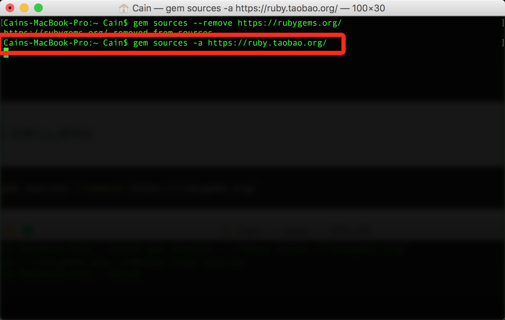
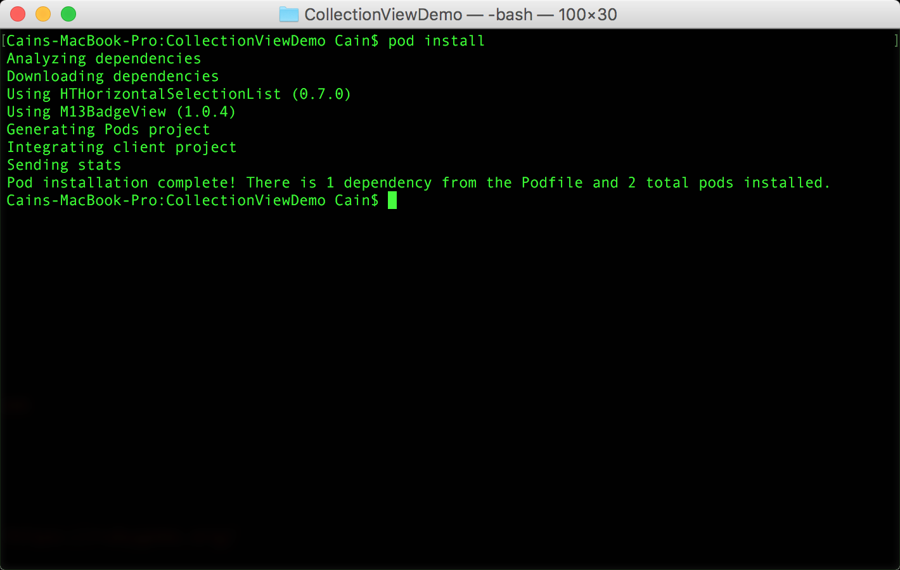

# <center>玩转iOS开发：《CocoaPods》安装及使用教程</center>

### 目录

- [作者感言](#作者感言)
- [介绍](#介绍)
- [什么是CocoaPods](#什么是CocoaPods)
- [CocoaPods的核心组件](#CocoaPods的核心组件)
- [更换Ruby源](#更换Ruby源)
- [安装CocoaPods](#安装CocoaPods)
- [使用CocoaPods](#使用CocoaPods)
- [升级CocoaPods](#升级CocoaPods)

---

###作者感言
>这次的**`CocoaPods`**的**`Review`**，让我知道了新版的**`CocoaPods`**和旧版的**`CocoaPods`**的区别, 在声明**`Podfile`**文件中, 需要加入对应的**`target`**才可以执行, 我个人感觉这个操作有些不太友好, 但他们要这么做, 我也没办法, 毕竟我只是小白用户而已.
>
>最后:
>如果你有更好的建议或者对这篇文章有不满的地方, 请联系我, 我会参考你们的意见再进行修改, 联系我时, 请备注**`CocoaPods`** 如果觉得好的话, 希望大家也可以打赏一下~嘻嘻~祝大家学习愉快~谢谢~
>

<p align="right">Cain(罗家辉)</p>
<p align="right">zhebushimengfei@qq.com: 联系方式</p>
<p align="right">350116542: 腾讯QQ</p>

---
###介绍
> 在**`iOS`**项目中使用第三方类库可以说是非常常见的事，但是要正确地配置他们有时候是非常繁琐的事情，幸运的是**`CocoaPods`**是一个很好的解决方案。

---
###什么是CocoaPods
> **`CocoaPods`**是**`OS X`**和**`iOS`**下的一个第三类库管理工具，通过CocoaPods工具我们可以为项目添加被称为**`Pods`**的依赖库（这些类库必须是**`CocoaPods`**本身所支持的），并且可以轻松管理其版本。

> **`CocoaPods`**意义体现在两个方面。
> * 第一，在引入第三方库时它可以自动为我们完成各种各样的配置，包括配置编译阶段、连接器选项、甚至是**`ARC`**环境下的**`-fno-objc-arc`**配置等。
>
> * 第二，使用**`CocoaPods`**可以很方便地查找新的第三方库，这些类库是比较“标准的”，而不是网上随便找到的，这样可以让我们找到真正好用的类库。

> 接下来我们将介绍**`CocoaPods`**的使用。

---
###CocoaPods的核心组件
> **`CocoaPods`**是用**`Ruby`**写的，并划分成了若干个**`Gem`**包。

> **`CocoaPods`**在解析执行过程中最重要的几个包的路径分别是：
> * **`CocoaPods/CocoaPods`**
> * **`CocoaPods/Core`**
> * **`CocoaPods/Xcodeproj`**

> **`CocoaPods / CocoaPod`**：这是面向用户的组件，每当执行一个pod命令时，这个组件将被激活。它包括了所有实用**`CocoaPods`**的功能，并且还能调用其他**`gem`**包来执行任务。 

> **`CocoaPods / Core`**：**`Core gem`**提供了与**`CocoaPods`**相关的文件（主要是**`podfile`**和**`podspecs`**）的处理。 

> **`Podfile`**：该文件用于配置项目所需要的第三方库，它可以被高度定制。本文中我们主要在这里做动作。

> **`Podspec`**：该文件描述了一个库将怎样被添加进工程中，**`.podspec`**文件可以标识该第三方库所需要的源码文件、依赖库、编译选项，以及其他第三方库需要的配置。 

> **`CocoaPods / Xcodeproj`**：这个包负责处理工程文件，它能创建以及修改**`.xcodeproj`**文件和**`.xcworkspace`**文件。它也可以作为一个独立的包使用，当你要编写修改项目文件的脚本时，可以考虑使用**`CocoaPods/Xcodeproj`**。

---
###更换Ruby源

> 检查**`Ruby`**环境，一般来讲**`Mac OS`**都是自带**`Ruby`**环境的，在Terminal中输入命令即可查看**`Ruby`**的版本号

```vim
ruby -v
```


> 切换**`Ruby`**源地址

```vim
gem sources --remove https://rubygems.org/
```


```vim
#等有反应之后再敲入以下命令
gem sources -a https://ruby.taobao.org/
```


```vim
#为了验证你的Ruby镜像是并且仅是taobao，可以用以下命令查看：
gem sources -l
```


---
###安装CocoaPods

> 现在我们在**`Terminal`**中输入以下命令, 输入机子的登录密码(没有密码的直接回车, 忘记密码的也别问我, 我也不知道怎么办), 等待自动完成安装就可以了

```vim
sudo gem install cocoapods
```


> 安装完成之后就会有以下的提示
> 


> 如果你不确定自己是否安装成功, 可以输入下面这个命令去查看

```vim
pod
```


> 如果有以上的提示, 那就证明你是安装成功的, 如果安装不成功, 继续输入安装命令

---
###使用CocoaPods

> 创建**`Xcode`**项目(怎么创建**`Xcode`**项目这里我就不说了), 然后打开**`Terminal`**直接**`cd`**到工程的根目录中, 这里我使用一个**`Demo`**
> 


> Xcode项目中创建Podfile文件, 且编辑


> 保存**`Podfile`**文件, 直接运行**`CocoaPods`**的命令, 如果该开源项目有其他项目的依赖, **`CocoaPods`**会自动下载对应的依赖项目.
> PS: 里面的两端文字并不是自己写得, 是需要去**`GitHub`**里查看该项目最高支持**`iOS版本`**是多少, 以及该开源项目是第几个版本.


> 由于我们的**`CocoaPods`**是第一安装, 所以会提示**`Setting up CocoaPods master repo`**, 这个时候我们只要静静的等待它初始化完, 这个等待的时间会比较长, 耐心等待吧, 骚年们~~要是想知道**`CocoaPods`**初始化多少了, 我们可以进入到**`CocoaPods`**的目录, 然后输入

```vim
du -sh
```


> **<font color=red>PS: 如果中途安装失败, 重复命令即可.</font>**

<dr>

> 初始化结束之后, 我们就可以继续捣鼓了, 但是我们发现, 出错了, 去[**CocoaPods**](https://cocoapods.org)官网看了一下, 原来是少添加了一个指定的**`target`**, 这个**`target`**是在哪里获取呢? 下面看图~~


> 然后我们再次打开**`Podfile`**, 编辑它, 保存, 再次**`install`**

```vim
target 'CollectionViewDemo' do
   pod 'HTHorizontalSelectionList', '~> 0.7.0'
end
```




> OK, 成功了, 我们会看到工程里多了一些文件, 而我们再也不会运行**`.xcodeproj`**工程文件, 而是运行**`.xcworkspace`**


> 关于怎么去使用第三方的库这里我就不需要再去说了, 大家都懂的

---
###升级CocoaPods

> 先更新gem	
```vim
sudo gem update —system
```
> 删除rubygems源
```vim
gem sources --remove https://rubygems.org/
```
> 添加ruby淘宝源
```vim
gem sources -a https://ruby.taobao.org/
```
> 测试源是否正确, 和刚开始安装时一样
```vim
gem sources -l
```
> 安装CocoaPods
```vim
sudo gem install cocoa pods
pod setup
```
> 查看CocoaPods版本
```vim
pod --version
```


