# <center>玩转iOS开发：《iOS设计模式 — 代理模式》</center>

---
- [作者感言](#作者感言)
- [简介](#简介)
- [创建工程](#创建工程)
- [创建代理类](#创建代理类)
  -  [声明代理类](#声明代理类)
  -  [声明代理方法](#声明代理方法)
  -  [内部实现代理方法](#内部实现代理方法)
  -  [外部调用代理](#外部调用代理)
- [代理与协议的区别](#代理与协议的区别)
  - [代理与协议](#代理与协议)
  - [创建协议](#创建协议)
  - [创建顾客类](#创建顾客类)
- [补充一点](#补充一点)
- [最后总结](#最后总结) 

---
### 作者感言
> 上次我们知道了单例模式是怎么回事, 现在我们来探讨一下什么叫做**`代理模式`**.
>
> 其实所谓的代理模式在我们日常生活中非常的常见, 比如买车, 各式各样的牌子都有, 但这些汽车生产商又不可能自己掏钱在每个城市的每个角落都开一家自己的直营店, 所以他们会去招一些第三方的代理商进行分销, 而这个就是我们今天所要说的**`代理模式`**.
>
> 最后:
> 如果你有更好的建议或者对这篇文章有不满的地方, 请联系我, 我会参考你们的意见再进行修改, 联系我时, 请备注**`代理模式`**, 如果觉得好的话, 希望大家也可以打赏一下~嘻嘻~祝大家学习愉快~谢谢~


Cain(罗家辉)
联系方式: zhebushimengfei@qq.com
腾讯QQ: 350116542

---
### 简介
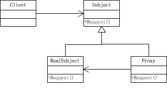

> 这是一张**`代理模式`**的UML图, 同样也很简单的讲解了**`代理模式`**到底是怎么回事
>
> 顺序如下: 
> - 1.**`Client(客户)`**向**`Subject(代理店)`**发起购买汽车的请求
> - 2.**`Subject(代理店)`**会向**`Proxy(生产商)`**进行提单
> - 3.**`Proxy(生产商)`**按照提单进行交货给**`Subject(代理店)`**
> - 4.**`Subject(代理点)`**再交付给**`Client(客户)`**, 

---
### 创建工程

> 打开我们自己创建的**`DesignPatternWork`**文件夹, 里面有我们之前所创建的**`DesignPatternWorkSpace`**

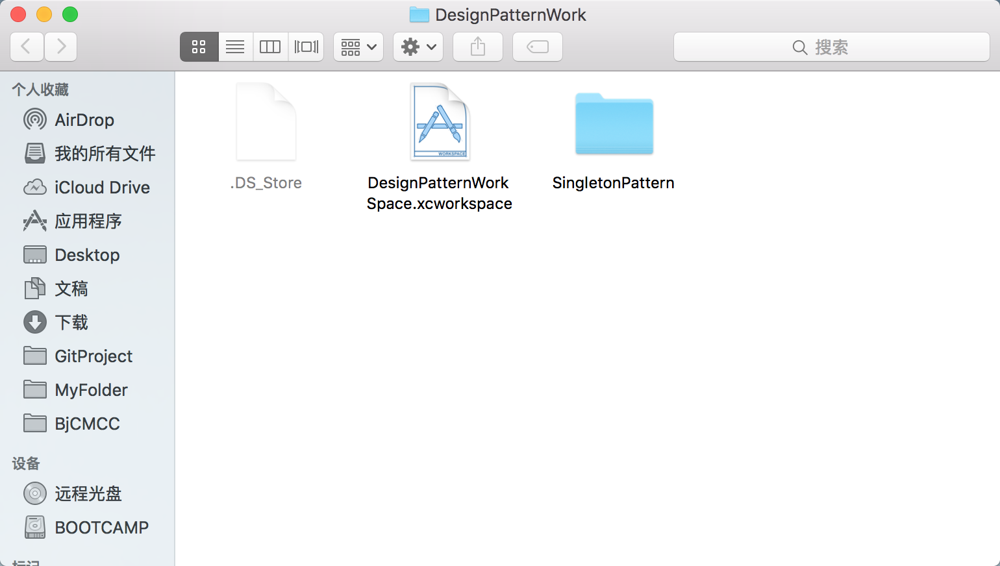

> 添加我们所要创建的新工程, 命名为**`ProxyPattern`**

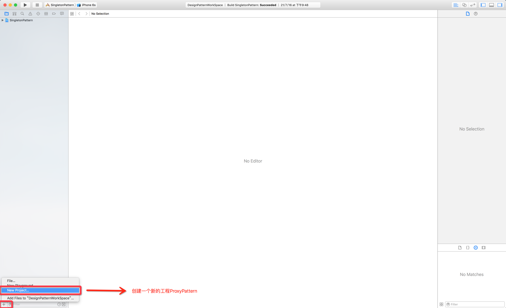

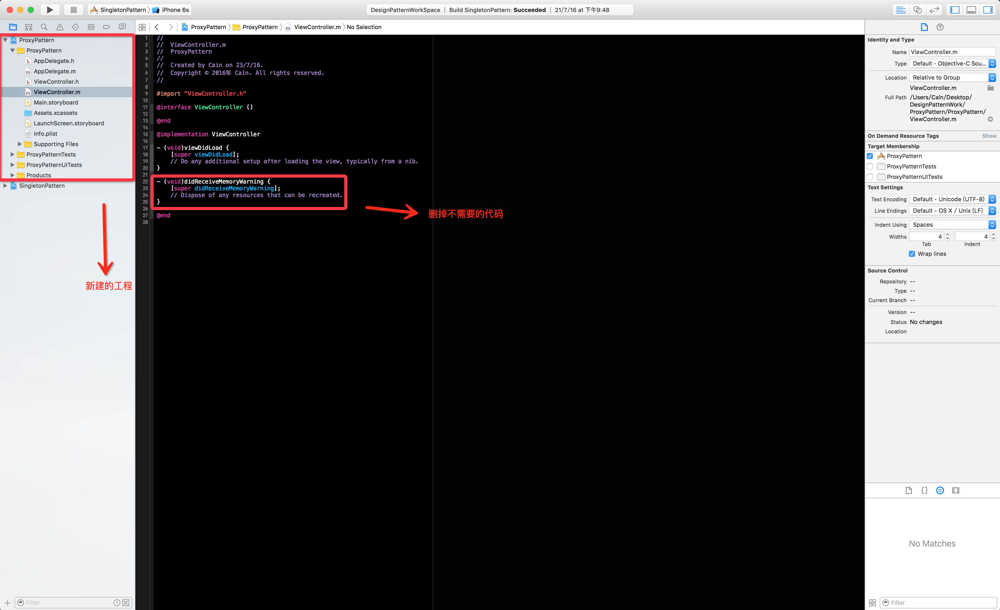

---
## <center>创建代理类</center>
### 声明代理类

> 这里我们就拿奥迪这个汽车生产商来进行演示, 原谅我是个奥迪控~~

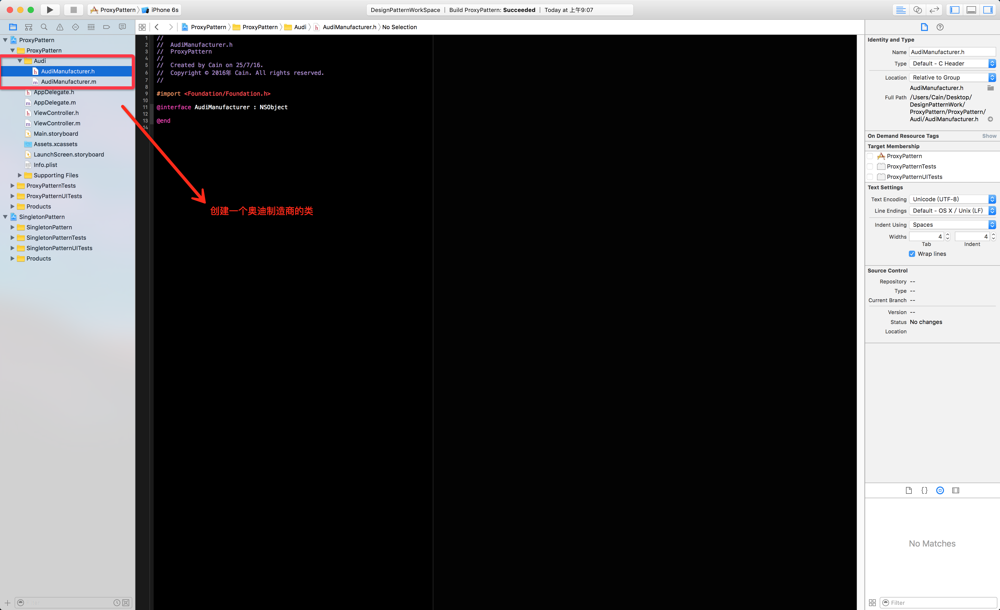

---
### 声明代理方法

> 在这里声明两个代理方法, 但他们有所区别, 一个是必须实现, 一个是可选类型的, 由于方法名自注释, 我这里就不添加注释了.

```objectivec
@required
- (void)audiManufacturer:(AudiManufacturer *)audiManufacturer
           orderQuantity:(NSInteger)orderQuantity;
```

```objectivec
@optional
- (void)audiManufacturer:(AudiManufacturer *)audiManufacturer
            audiDelegateInfo:(NSString *)audiDelegateInfo;
```

> 解释一下, 为什么我们需要在代理方法中提供代理类, 其实这个很好理解, 打个比方, 就拿奥迪来说吧, 一个品牌的车子, 肯定有不同的型号, 而每个型号不一定都是在同一家工厂里生产的, 这个时候我们就需要区分生产地, 所以我们为了提供外部去区分, 就需要在代理方法中提供代理类**`(个人理解, 不是官方语言哈)`**.

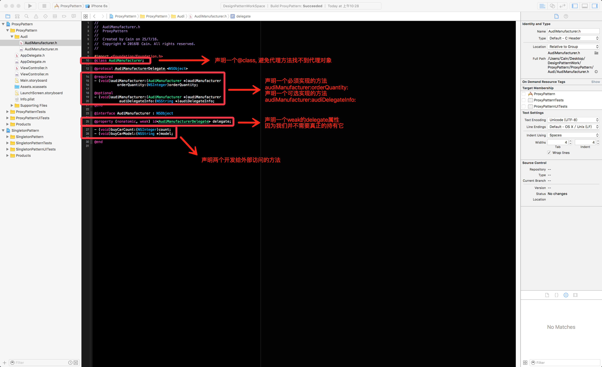

---
### 内部实现代理方法
> 在内部实现两个对方开放的方法

```objectivec
- (void)buyCarCount:(NSInteger)count;
- (void)buyCarModel:(NSString *)model;
```

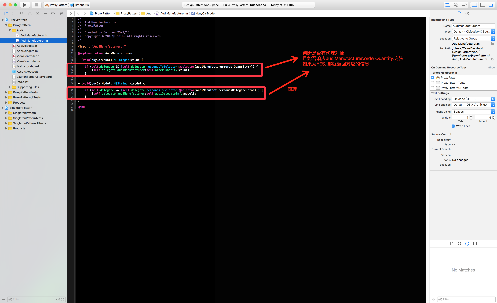

---
### 外部调用代理
> 代理类以及代理方法我们已经完成了, 接下来我们就要在外部去实现了

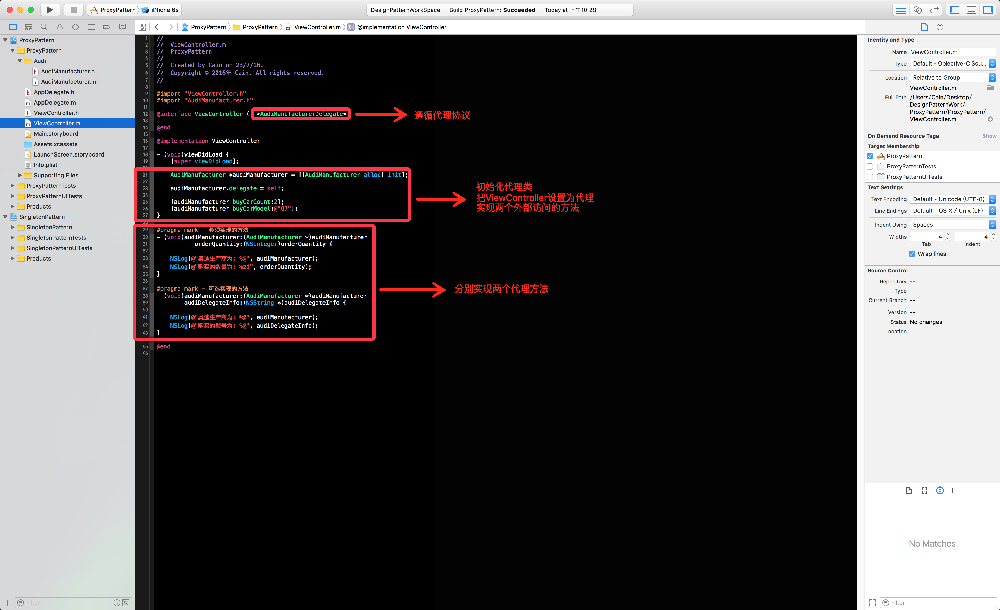

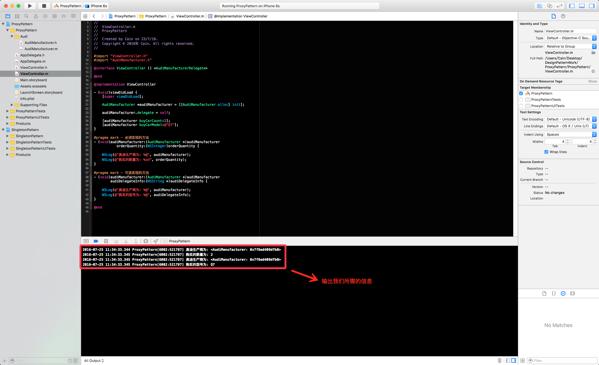

---
##<center>代理与协议的区别</center>
### 代理与协议

> 到这里, 我们已经完成了整个代理模式的所有要求了, 但还有一些小细节需要提提.


> **`代理职能: `**降低对象与对象之间的耦合度
>  **`协议职能: `**主要是用来约束对象或筛选对象
>  **`代理与协议的相似: `**代理与协议都是使用**`@protocol`**来进行声明, 并且提供方法的一种模式, 看起来没啥不一样.
>  **`代理与协议的不同: `**其实就如同它们的职能所说, **`代理`**是为了降低对象与对象之间的耦合度, **`协议`**是用来约束对象或筛选对象

---
### 创建协议
> 这里我们用代码演示一下吧, 这样子更加的简单明了, 不过这里要注意一下, **`Protocol`**是没有**`.m`**文件的


---
### 创建顾客类
> 创建完协议就要创建顾客了, 并且这个顾客类是必须遵守我们创建的**`Protocol`**, 然后在这个**`Protocol`**里加个判断.


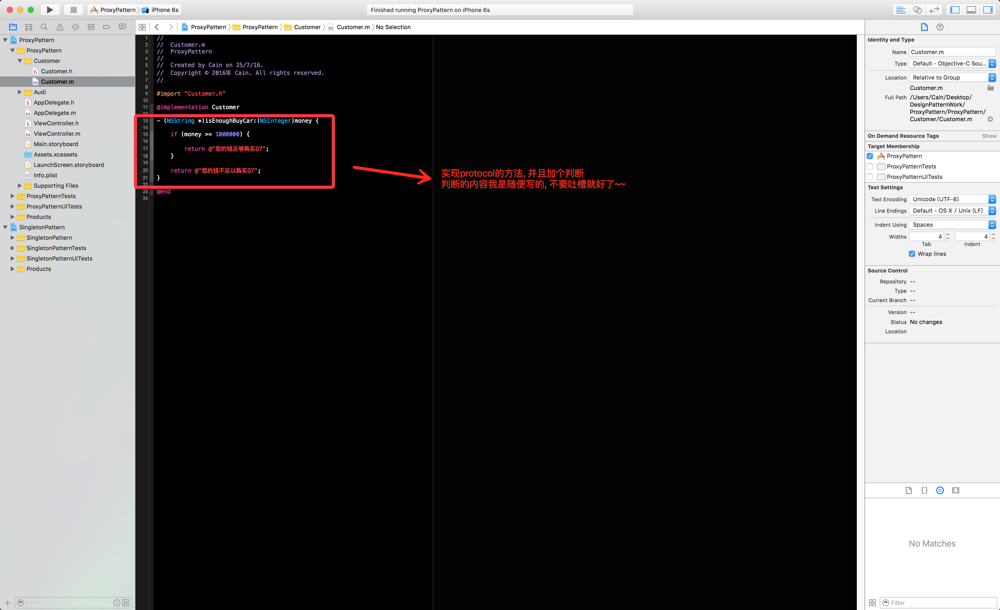


> 现在我们来初始化一下这个顾客类, 并且校验一下我们所写的**`Protocol`**是否生效.

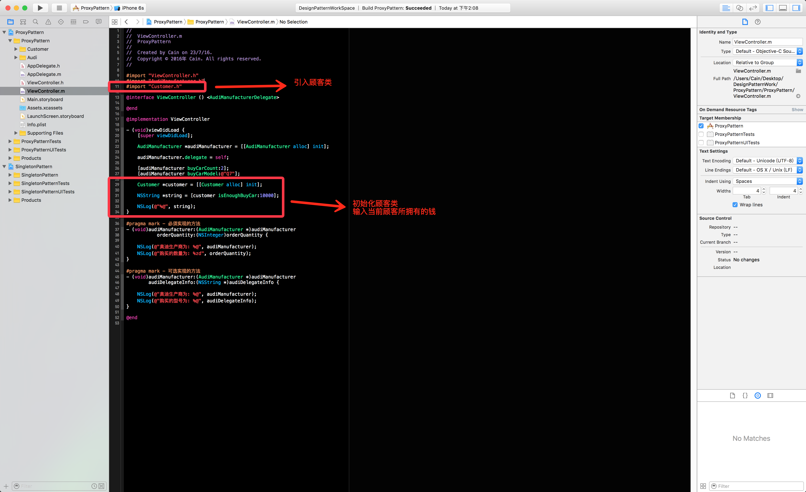

> 先输入**`10000`**

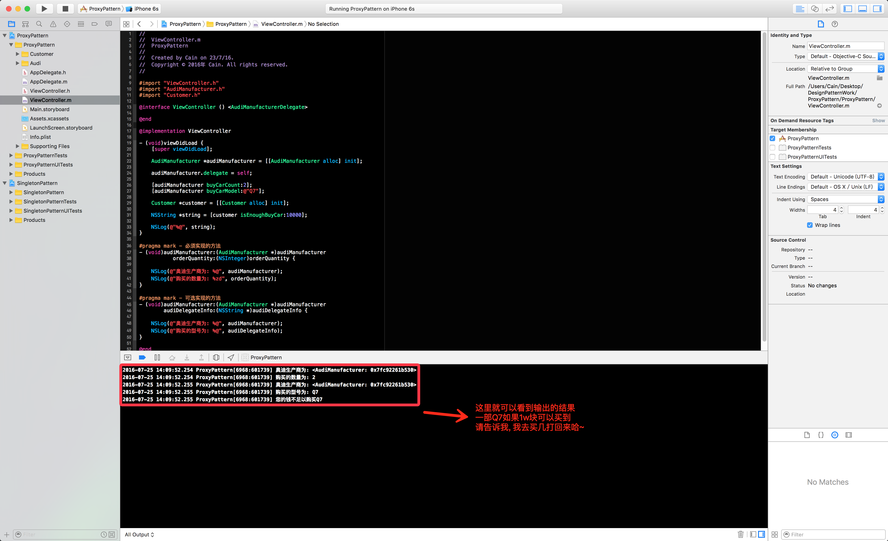

> 再输入**`1000000`**


---
### 补充一点

> 其实在iOS中, 就有一个类叫做**`NSProxy`**, 它也可以用来实现**`代理模式`**, 但在这里先不做介绍, 后面有时间再另外写一篇文章去讲解怎么用**`NSProxy`**去实现代理模式, 如果有好奇心特别重的朋友, 也可以自行去翻查一下资料~

---
### 最后总结

> 经过上面的演示, 就知道**`代理模式`**并没有想象中那么复杂, 说白了, 所谓的**`代理模式`**就是为了降低对象与对象之间的耦合度, 为了方便维护罢了, 同时我们也知道了**`代理`**与**`协议`**之间的区别, 这篇文章就到了, 谢谢大家的观看~