# 玩转iOS开发：《iOS设计模式 — 单例模式》

---

[TOC]

---
###作者感言
>在我写这篇文章的时候, 虽然国内有一堆文章介绍UIActivityViewController和UIActivity, 但都是零零散散的, 哪怕我翻墙出去看YouTube, 或者是著名的黑胡子博客, 都没有详细的讲解怎么去自定义所需的UIActivity, 最后基本上翻遍了谷歌, 才找到了所需的.

>最后:
>如果你有更好的建议或者对这篇文章有不满的地方, 请联系我, 我会参考你们的意见再进行修改, 联系我时, 请备注UIActivityViewController 如果觉得好的话, 希望大家也可以打赏一下~嘻嘻~祝大家学习愉快~谢谢~

Cain(罗家辉)
联系方式: zhebushimengfei@qq.com
腾讯QQ: 350116542

---
### 简介

> 有一段时间没有发简书了, 刚好现在忙完项目的需求, 现在可以闲下来写写简书, 顺便自己给自己复习巩固一下知识, 不过我在这里又要吐槽一句, 项目中遇到了一个单例的问题, 让我感到非常的蛋疼, 写这个单例的人只是单纯了为了写单例而写单例, 没有想到会发生什么, 现在让我们一起来看看什么叫单例吧.

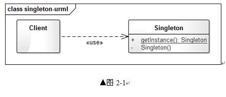

> 这是一张单例的**`UML`**图, 非常简单明了的讲解单例类到底是怎么回事, 通常单例是用来作为管理中心, 或者是通知中心, 比如在**`iOS`**当中的**`NSNotificationCenter`**, **`[[UIApplication sharedApplication] statusBarStyle]`**, **`NSUserDefaults`**, **`[NSFileManager defaultManager]`**等等都是单例, 单例类有几个特征.
>
> * 系统当中只有一个实例
> * 易于外界访问
> * 防止子类继承
> * 共享信息

---
### 准备工作

> 首先, 我们先来建一个**`WorkSpace`**, 这样子方便我们以后多添加工程, 因为单例模式只是我们的开始.

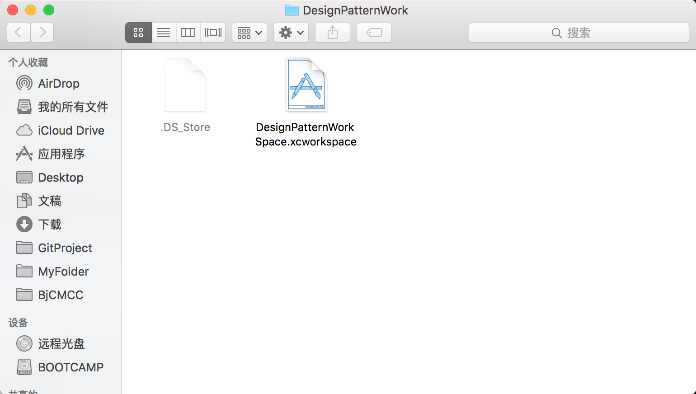

---
### 添加单例工程

> 创建完**`WorkingSpace`**之后, 我们就来添加**`SingletonPattern(单例)`**的工程

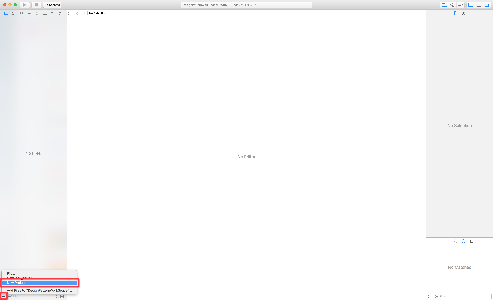

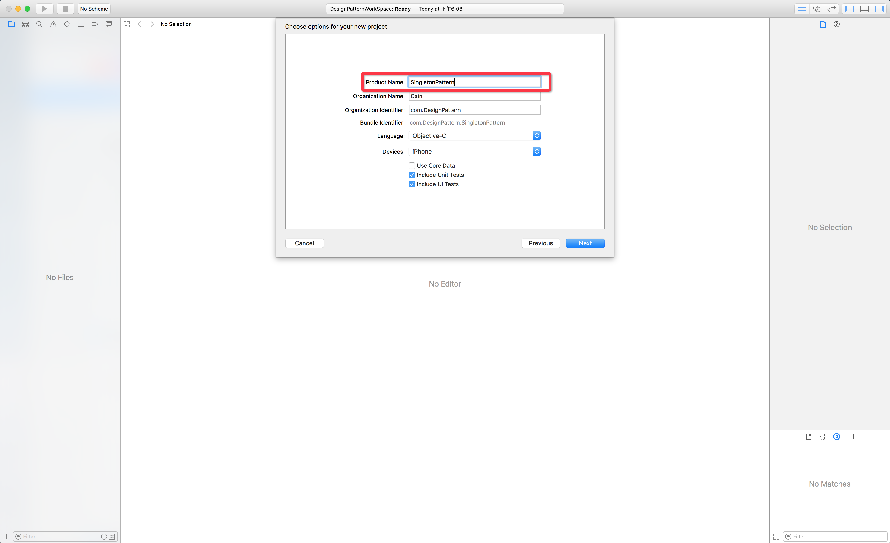

---
### 创建单例类

> 现在我们来创建一个叫**`UserInfoManager`**单例类

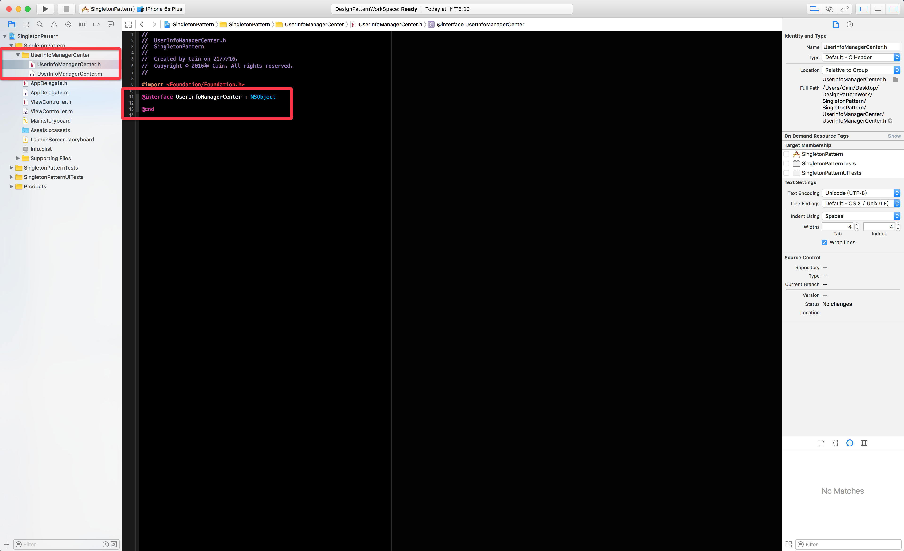

> 声明一个类方法用于外界访问 

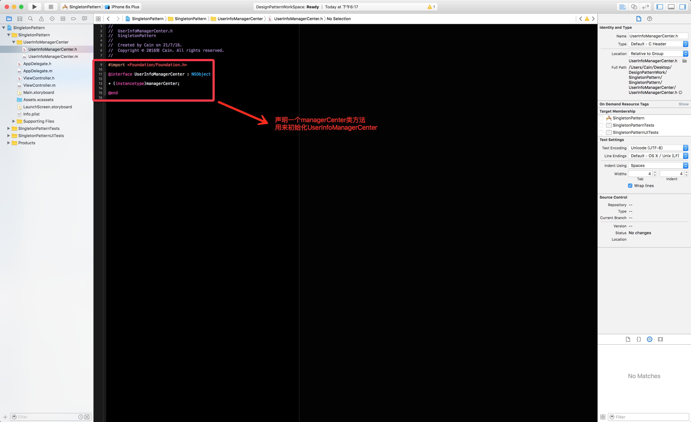

> 接下来我们去实现这个类方法就好了

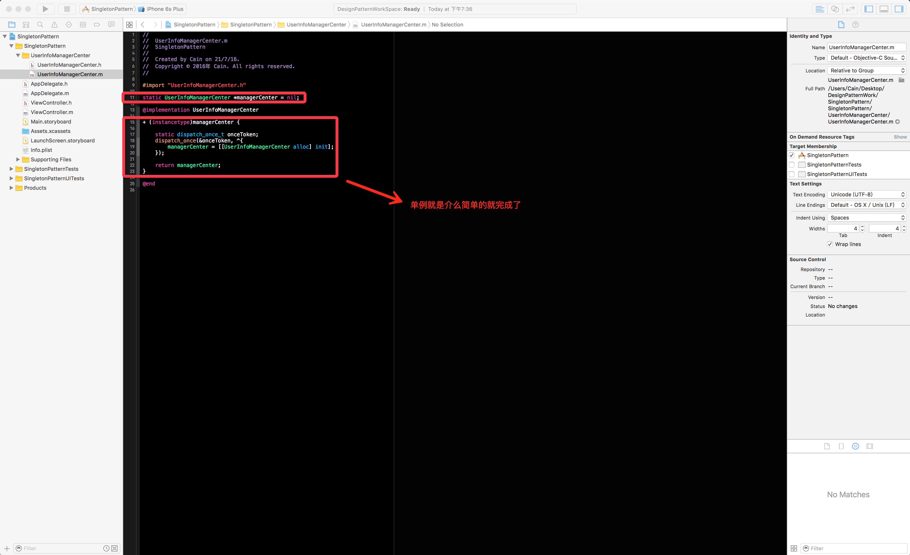

> 看起来, 我们好像搞定了整个单例模式了, 下面让我们来试试效果.

 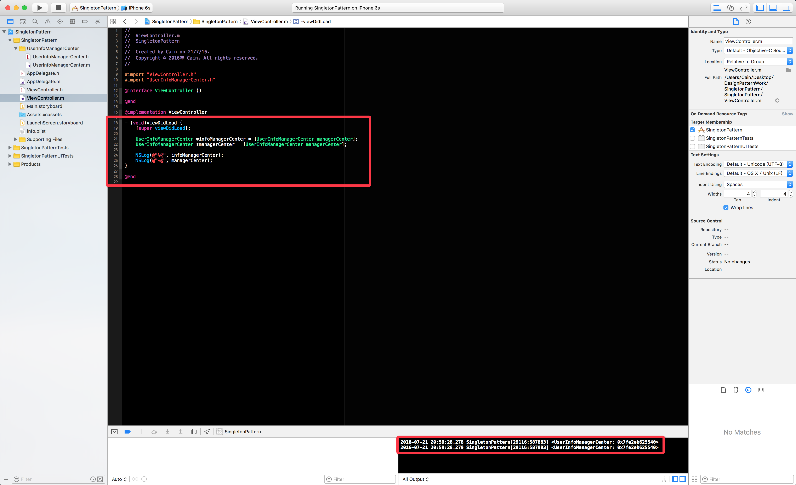

> 打印出来的效果好像是只有一个, 但实际上并不是的, 我们再来看看

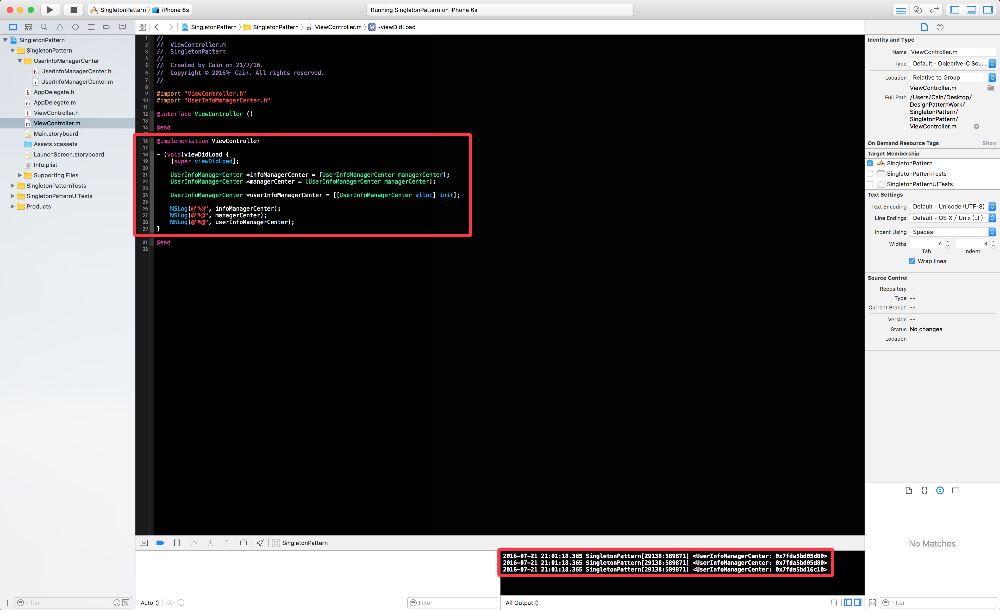

> 发现这个类还是可以初始化的, 并且是另外开辟了内存空间来存储的, 这就很尴尬了, 说好的只有一个实例呢??? 

> 我在这里说一句, 施主莫怕, 等贫僧跳大, 继续回到单例类当中, 添加几个判断就好了

 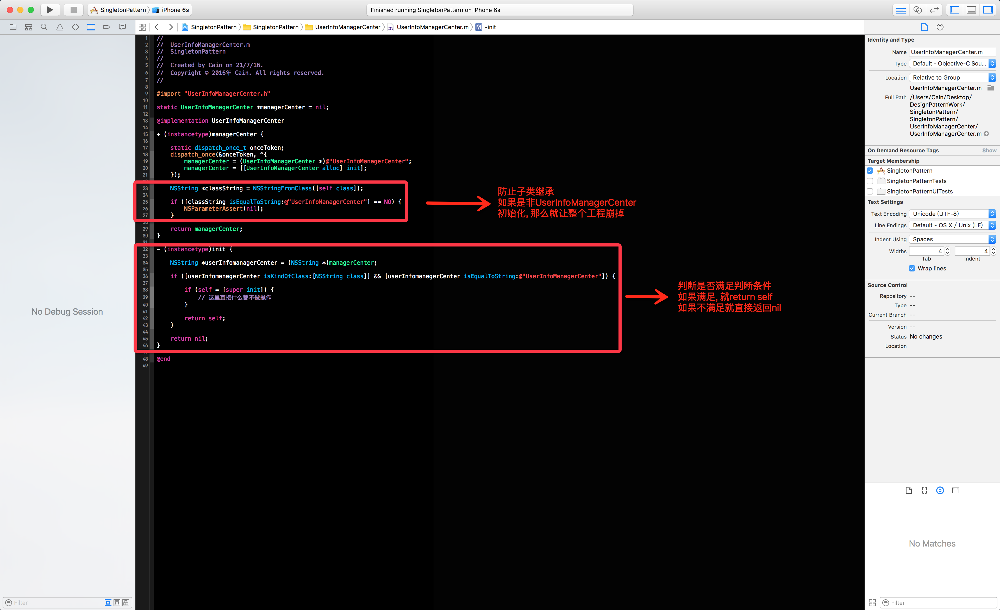

>口说无凭, 我们来看看运行效果

 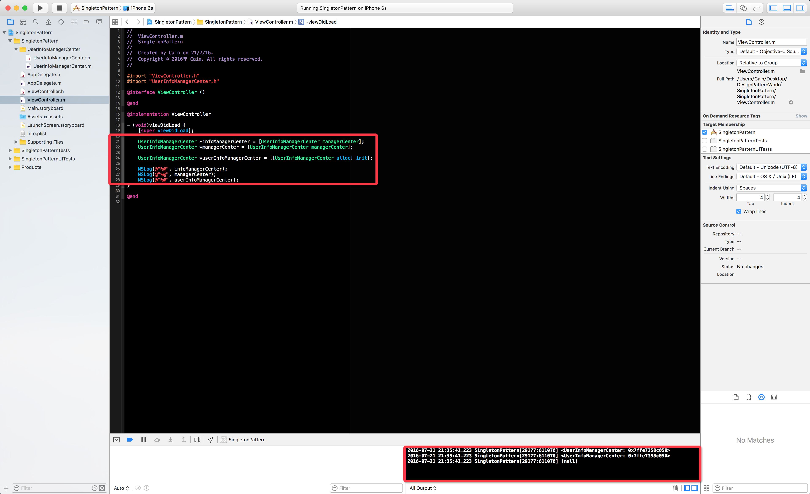

> 这下子, 可以说明是只有一个实例了吧, 下面再来看看子类是否能继承

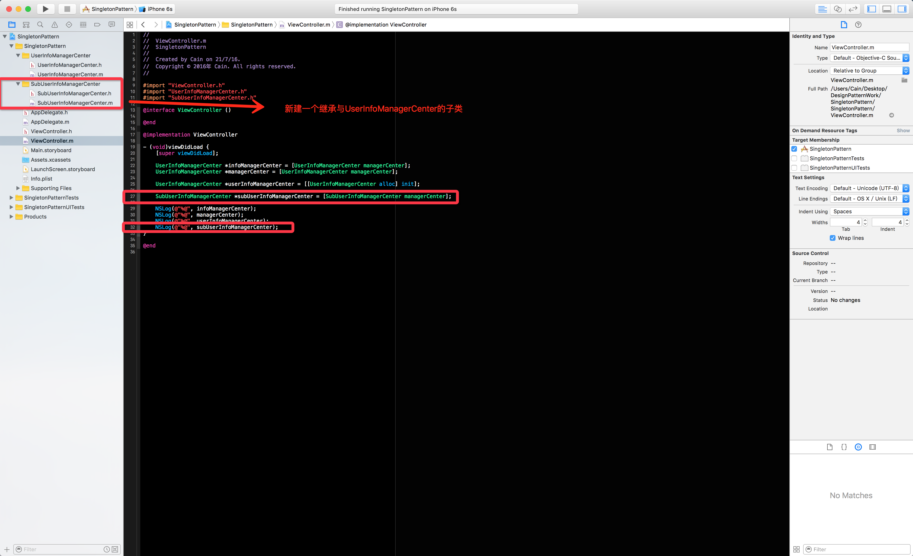

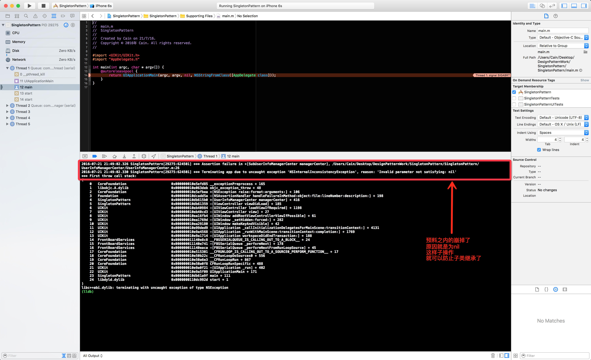

---

> 好了, 现在单例所需的
>
> * 易于外界访问
> * 系统当中只有一个实例
> * 防止子类继承
>
> 我们都搞定, 酱紫我们就完成了一个单例类的创建啦

---
> 工程地址: https://github.com/CainRun/DesignPattern/tree/master/SingletonPattern