# 
玩转iOS开发：《使用系统自带的UIActivityViewController和UIActivity进行内容分享》

---
###简介
> 这段时间有很多朋友都问我关于怎么去集成**`ShareSDK`**或者**`友盟社会化分享SDK`**的问题, 其实我想说, **`Apple`**一开始就提供了一个类, 供我们去使用分享了, 在**`iOS 6`**之后更加增强了这个类, 使我们不再需要集成第三方的, 而且还支持自定义分享的**`item`**.

---
###作者感言
> 在我写这篇文章的时候, 虽然国内有一堆文章介绍**`UIActivityViewController`**和**`UIActivity`**, 但都是零零散散的, 哪怕我翻墙出去看**`YouTube`**, 或者是著名的**[黑胡子博客](http://nshipster.com/uiactivityviewcontroller/)**, 都没有详细的讲解怎么去自定义所需的**`UIActivity`**, 最后基本上翻遍了谷歌, 才找到了所需的.
> 
> **最后:**
> 如果你有更好的建议或者对这篇文章有不满的地方, 请联系我, 我会参考你们的意见再进行修改, 联系我时, 请备注**`UIActivityViewController`** 如果觉得好的话, 希望大家也可以打赏一下~嘻嘻~祝大家学习愉快~谢谢~
>

Cain(罗家辉)

zhebushimengfei@qq.com: 联系方式

350116542: 腾讯QQ

---
###创建新工程

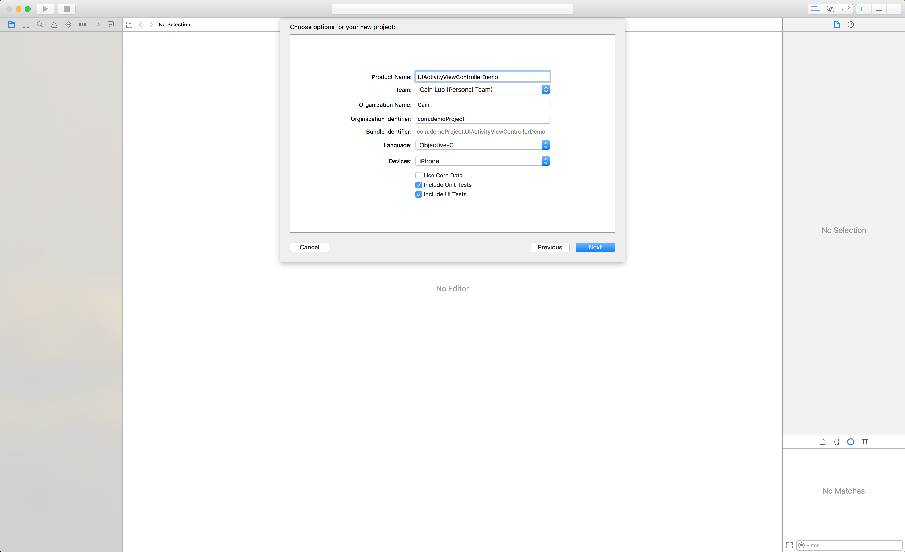
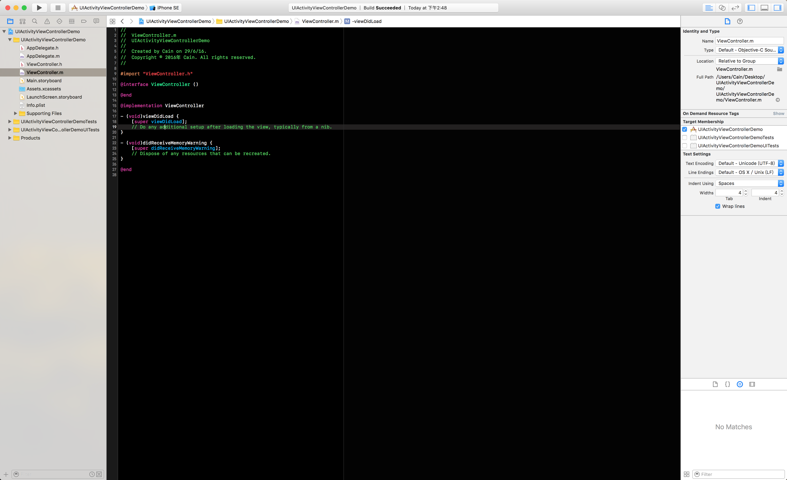

---
###创建一个继承与UIActivityViewController的类

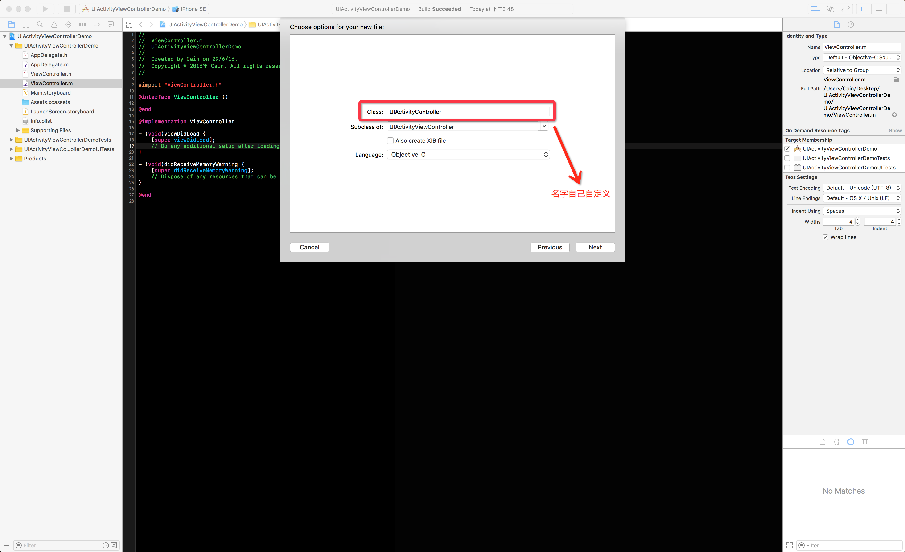
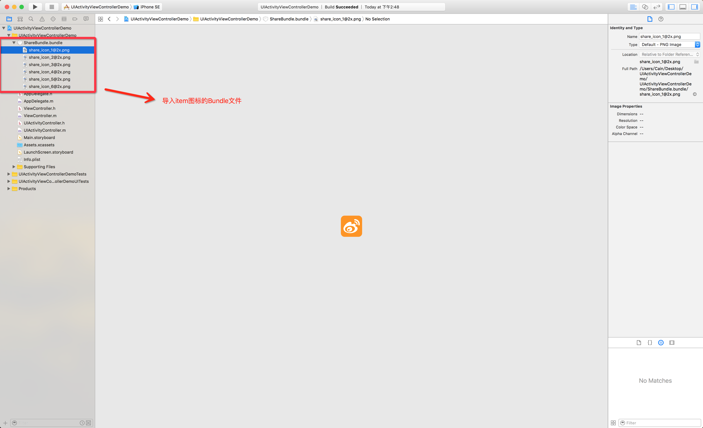

---
###创建一个继承与UIActivity的类

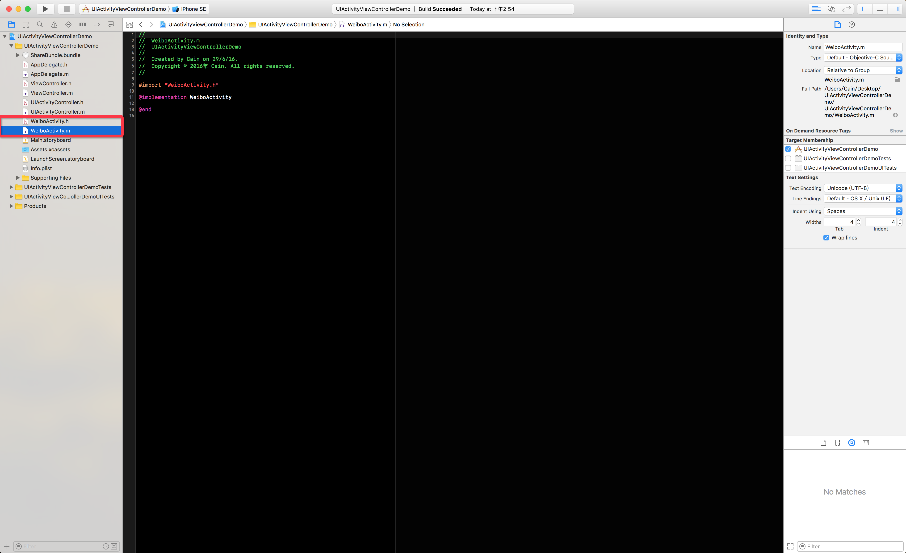

> 这时候我们就要来给这个自定义的**`UIActivity`**类写上我们需要的内容, 首先我们可以去到系统提供的**`UIActivity`**头文件看**`API`**, 获取我们所需的**`API`**.

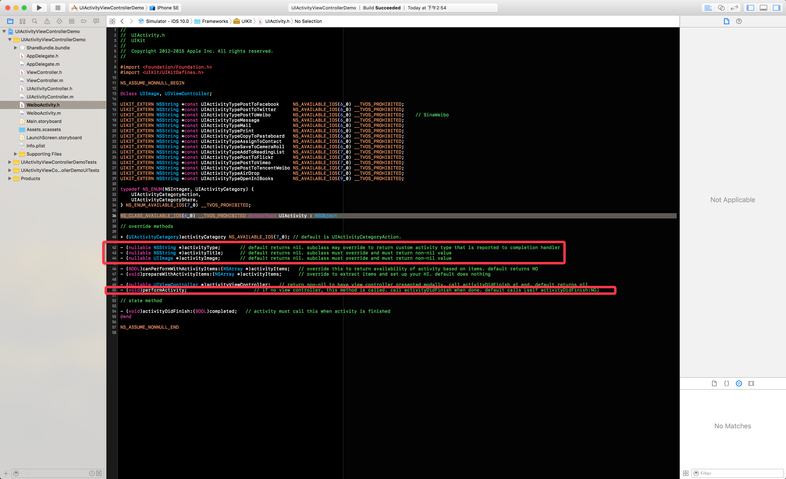

---
###配置UIActivity和UIActivityViewController

> 下面是我写好的自定义**`WeiboActivity`** **`API`**

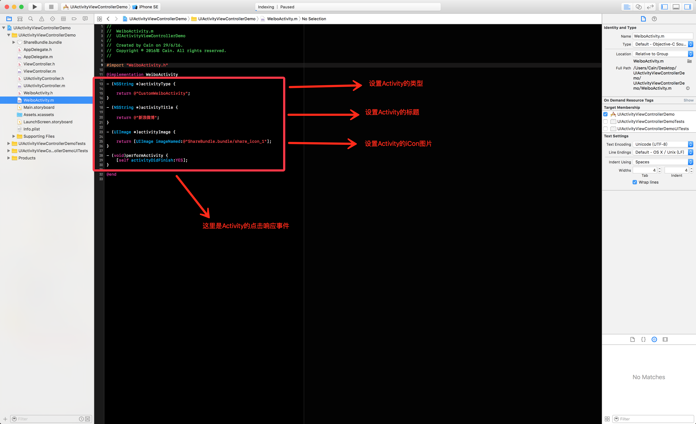

> 下面是我写好的自定义**`UIActivityController`**

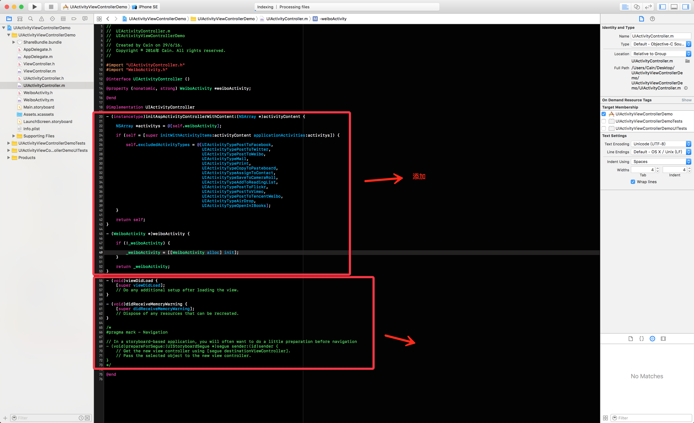

> 这里和大家说说**`excludedActivityTypes`**这个属性, 这个属性其实是一个数组属性, 代表的是, 如果我们不需要系统的服务就可以给它赋值, 这样子**`UIActivityViewController`**就不会显示对应的服务, 我这里默认全部干掉, 一个服务都不需要, 当然如果需要干掉我们自定义的**`UIActivity`**, 也可以在这里写上.

> 还有一点, 就是我们给**`UIActivityViewController`**赋值自定义的**`UIActivity`**
> 
> PS: 注意一点, 这个赋值只能在**`initWithActivityItems: applicationActivities:`**这个方法的**`applicationActivities:`**赋值, 而且只能在初始化的时候赋值, 一旦赋值之后就不能再修改了.

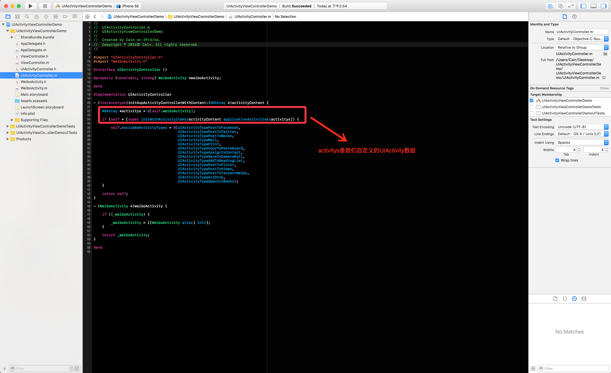

---
###调起UIActivityViewController

> 最重要的地方来了, 就是调起我们自定义的**`UIActivityController`**.
> 
> 首先我们要在**`Main.storyboard`**中拖一个**`UIButton`**, 然后添加对应的代码.

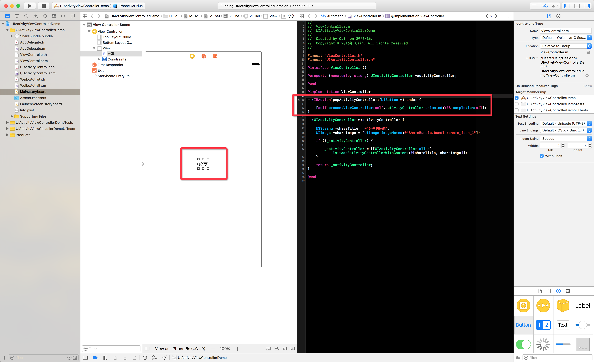

> 最后我们运行一下看看效果

> 发现什么都没有, 肯定在喷我, 觉得我是在耍你们, 哈哈, 其实在这里我们少了一个方法没有添加, 回到我们自定义的**`WeiboActivity`**中, 添加上就OK了

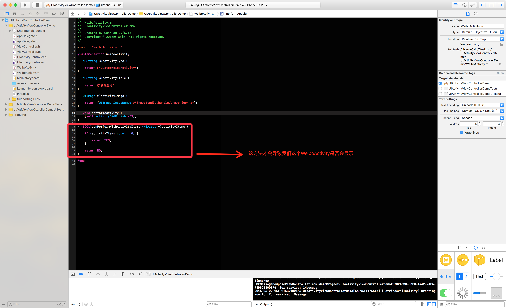

> 再来运行看看效果

> 好了, **`item`**出来了, 但好像有什么不对, 图标呢???!!! 为啥是灰色的? 楼主你耍我, 我要去爆你菊花!!!!!
> 
> 别紧张, 在系统默认的**`UIActivityViewController`**中, 下面这部分是属于系统服务, 默认只会显示一个轮廓, 并不会显示整张图片, 下面我们把自定义的**`WeiboActivity`**显示图片的方法改改就好了.

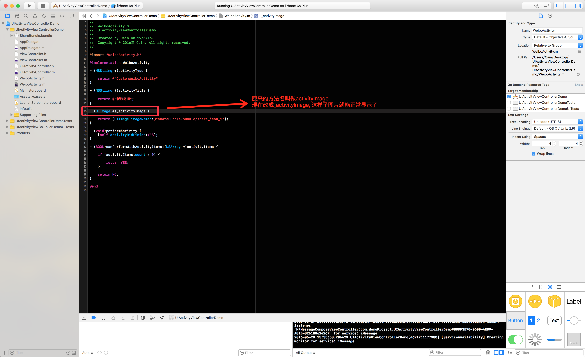

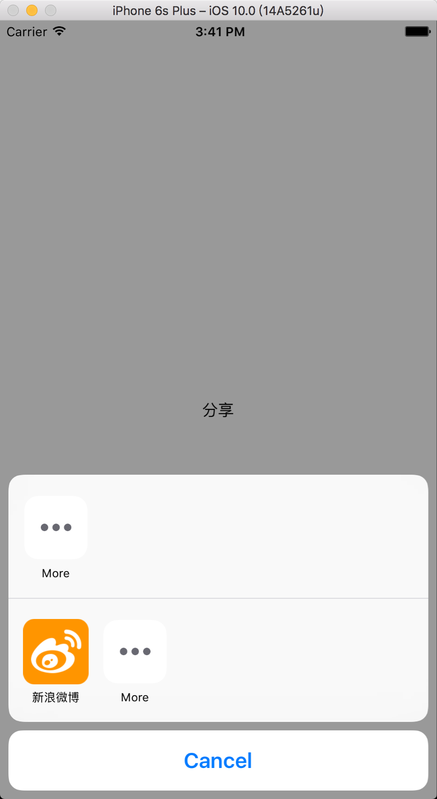

> 好了, 我的菊花保住了, 图标出来了, 把我吓了一身冷汗
> 
> 图标出来了, 我们就要给这个**`item`**添加点击事件了, 做什么好呢, 总不可能让我去导个微信微博等SDK进来演示, 毕竟还要去申请**`AppID`**和**`AppKey`**呢, 我们来个弹框吧~~~
>
> 我一般喜欢写个**`Block`**把点击事件抛出去做处理, 这次我也不例外~~

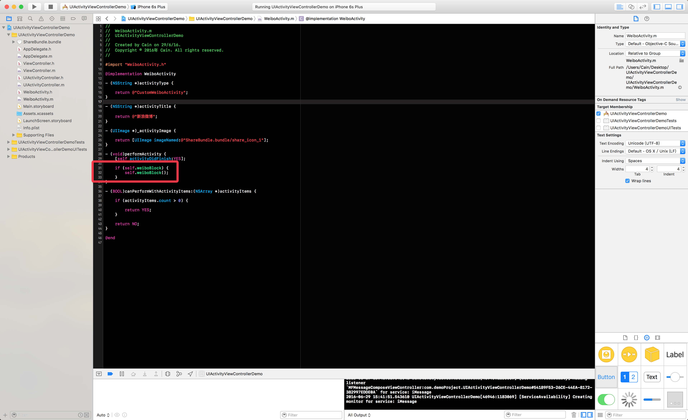
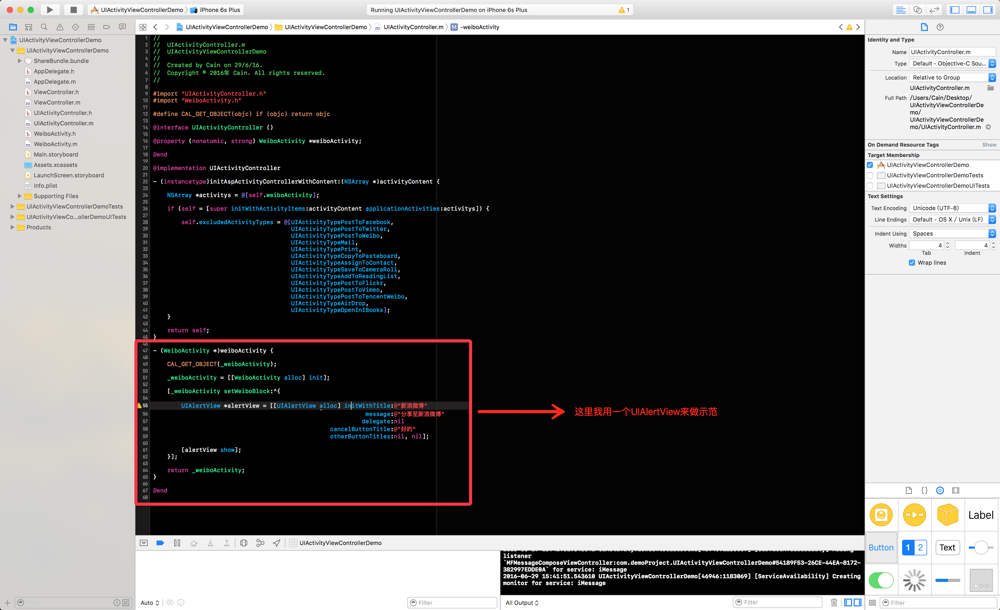

> PS: 由于我这里是做示范, 所以使用**`UIAlertView`**, 如果大家要在项目中使用的话, 尽量使用**`UIAlertController`**.

---
###最终效果

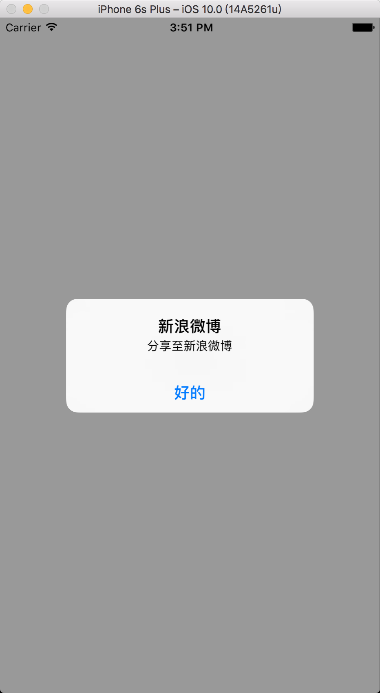

---
###GitHub工程地址

工程地址: https://github.com/CainRun/iOSDeveloperDocument/tree/master/%E7%8E%A9%E8%BD%ACiOS%E5%BC%80%E5%8F%91%EF%BC%9A%E3%80%8A%E4%BD%BF%E7%94%A8%E7%B3%BB%E7%BB%9F%E8%87%AA%E5%B8%A6%E7%9A%84UIActivityViewController%E5%92%8CUIActivity%E8%BF%9B%E8%A1%8C%E5%86%85%E5%AE%B9%E5%88%86%E4%BA%AB%E3%80%8B/UIActivityViewControllerDemo

---
### 结束语

> 好啦, 教程到这里就结束了, 谢谢大家的耐心观看
