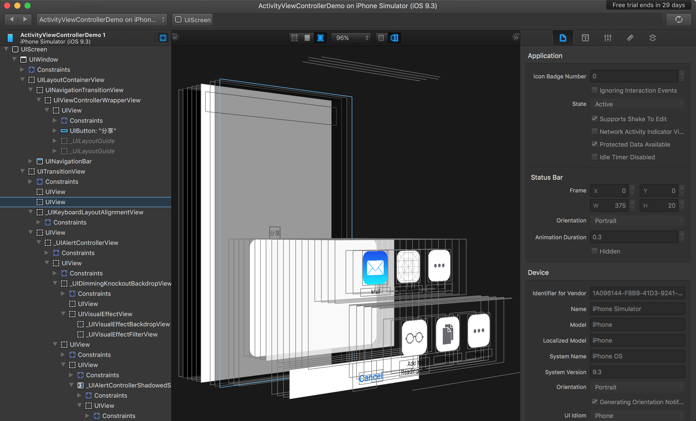

#<p align="center">玩转iOS开发：界面调试工具《Reveal》</p>

### 目录

- [作者感言](#作者感言)
- [疑问](#疑问)
- [添加Debug命令](#添加Debug命令)
- [在Xcode中启动Reveal](#在Xcode中启动Reveal)
- [查看Reveal效果](#查看Reveal效果)
- [特殊教程(无限试用)](#特殊教程(无限试用))
- [附件](#附件)

---

###作者感言
>这次的**`Reveal`**研究，让我发现调试UI再也不像会以前那么的困难, 更加不会那么的蛋疼, 不需要每次都在脑海里想象出那个画面, 自从使用了**`Reveal`**之后, 麻麻再也不用担心我调界面难过了~
>
>最后:
>如果你有更好的建议或者对这篇文章有不满的地方, 请联系我, 我会参考你们的意见再进行修改, 联系我时, 请备注**`Reveal`** 如果觉得好的话, 希望大家也可以打赏一下~嘻嘻~祝大家学习愉快~谢谢~
>

<p align="right">Cain(罗家辉)</p>
<p align="right">zhebushimengfei@qq.com: 联系方式</p>
<p align="right">350116542: 腾讯QQ</p>

---
###疑问
> 有童鞋可能会问, **`Xcode`**不是自带了有[Debug View Hierarchy in Xcode](https://developer.apple.com/library/ios/recipes/xcode_help-debugger/using_view_debugger/using_view_debugger.html)么, 为啥还要用第三方的Reveal, 答案就是:"因为苹果所提供的**`Debug View Hierarchy in Xcode`**弱爆了, 只能看看, 啥都不能操作, 而且还容易造成**`Xcode`**的卡顿, 比如一些电脑比较低配的, 卡死, 然后**`Xcode`**就一闪而过, 直接就**`Crash`**了."
>
> [Reveal](http://revealapp.com)就不会出现这个问题, Reveal是一款图形调试工具, 支持iOS全设备的UI调试, 支持模拟器以及真机调试, 同时也支持实时UI效果的展示.

---
###添加Debug命令

> 打开**`Terminal`**, 输入命令

```vim
vim ~/.lldbinit 
```


> 添加命令
```vim
command alias reveal_load_sim expr (void*)dlopen("/Applications/Reveal.app/Contents/SharedSupport/iOS-Libraries/libReveal.dylib", 0x2);  
command alias reveal_load_dev expr (void*)dlopen([(NSString*)[(NSBundle*)[NSBundle mainBundle] pathForResource:@"libReveal" ofType:@"dylib"] cStringUsingEncoding:0x4], 0x2);  
command alias reveal_start expr (void)[(NSNotificationCenter*)[NSNotificationCenter defaultCenter] postNotificationName:@"IBARevealRequestStart" object:nil];  
command alias reveal_stop expr (void)[(NSNotificationCenter*)[NSNotificationCenter defaultCenter] postNotificationName:@"IBARevealRequestStop" object: nil nil]; 
```


这里解释一下命令的意思
> **`reveal_load_sim`** 为模拟器加载reveal调试用的动态链接库
> **`reveal_load_dev`** 为真机加载
> **`reveal_start`**       启动reveal调试功能
> **`reveal_stop`**         结束reveal调试功能

---
###在Xcode中启动Reveal

> 首先打开**`Xcode`**的工程, 去到**`AppDelegate`**
> 


> 然后在**`application:didFinishLaunchingWithOptions`**方法中添加断点
> 


> 编辑断点, 添加对应的代码
> 
> 


> 运行工程, 如果看到控制台里输出以下酱紫的一行字, 就代表设置成功了
> 

---
###查看Reveal效果
> 看完上面的操作步骤, 只要你设置的都是正确的, 那就可以打开**`Reveal`**查看效果了
> 


> 如果你的模拟器切换了页面, **`Reveal`**是不会自动刷新的, 既然是酱紫, 那我们就需要做对应的操作
> 




---
###特殊教程(无限试用)

> 打开你的**`Terminal`**, 然后输入以下命令


> 找到**`com.ittybittyapps.Reveal.plist`**文件删掉
>
> PS: 这个文件每次运行的时候**`Reveal`**都会创建一次, 每次都是从第一天开始, 每次**`Reveal`**还有几天的时候, 再删掉, 就会再次从第一天开始.


> **<font color=red>这里声明一点, 作者是希望大家都去购买正版, 而不是去寻找什么破解方法, 毕竟我们本身就是做软件的, 所以希望大家可以去支持支持正版.</font>**

---
###附件
> 由于真机调试是需要修改**`Xcode`**工程配置, 不太适合团队协作, 所以这里我只提供了模拟器UI调试的方法, 如果有朋友需要真机调试, 这里有一个[官方教程](http://support.revealapp.com/kb/getting-started/integrating-reveal-add-reveal-to-your-xcode-project), 有兴趣的童鞋可以自行去查看

